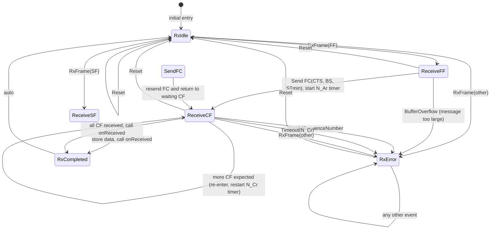

# ISOTP Receiver FSM (HFSM2)

## Состояния конечного автомата приёмника

| Состояние | Описание |
|-----------|----------|
| `RxIdle` | Ожидание первого кадра (SF или FF) |
| `ReceiveSF` | Получен SF – немедленно вызывается `onReceived` |
| `ReceiveFF` | Получен FF – отправляется FC, запускается сборка |
| `SendFC` | Повторная отправка Flow Control (при необходимости) |
| `ReceiveCF` | Ожидание и сборка Consecutive Frame (CF) |
| `RxCompleted` | Сообщение полностью собрано |
| `RxError` | Аварийное состояние (ошибка протокола, таймаут) |

## Диаграмма переходов

## Легенда событий

| Событие | Описание |
|---------|----------|
| `RxFrame(SF)` | Получен Single Frame |
| `RxFrame(FF)` | Получен First Frame |
| `RxFrame(CF)` | Получен Consecutive Frame |
| `Timeout(N_Ar)` | Истекло время ожидания первого CF |
| `Timeout(N_Cr)` | Истекло время между CF |
| `Reset` | Пользователь вызывает `reset()` |