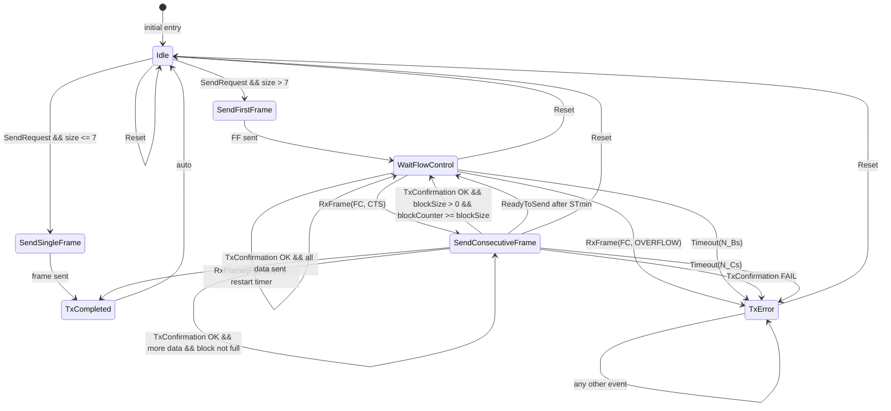

# ISOTP Transmitter FSM (HFSM2)

## Состояния конечного автомата передатчика

| Состояние | Описание |
|-----------|----------|
| `Idle` | Ожидание команды отправки |
| `SendSingleFrame` | Отправка SF (короткое сообщение ≤ 7 байт) |
| `SendFirstFrame` | Отправка FF (первый кадр длинного сообщения) |
| `WaitFlowControl` | Ожидание FC от получателя |
| `SendConsecutiveFrame` | Отправка очередного CF, учёт BlockSize и STmin |
| `TxCompleted` | Отправка завершена успешно |
| `TxError` | Аварийное состояние (таймаут, исключение, неверный FC) |

## Диаграмма переходов

## Легенда событий

| Событие | Описание |
|---------|----------|
| `SendRequest` | Пользователь вызывает `send()` |
| `RxFrame(FC)` | Получен кадр FlowControl (CTS, WAIT, OVERFLOW) |
| `TxConfirmation` | Подтверждение отправки CAN-кадра (success/fail) |
| `Timeout(N_Bs)` | Истекло время ожидания FC |
| `Timeout(N_Cs)` | Истекло время между CF (STmin) |
| `ReadyToSend` | Внутреннее событие после паузы STmin |
| `Reset` | Пользователь вызывает `reset()` |