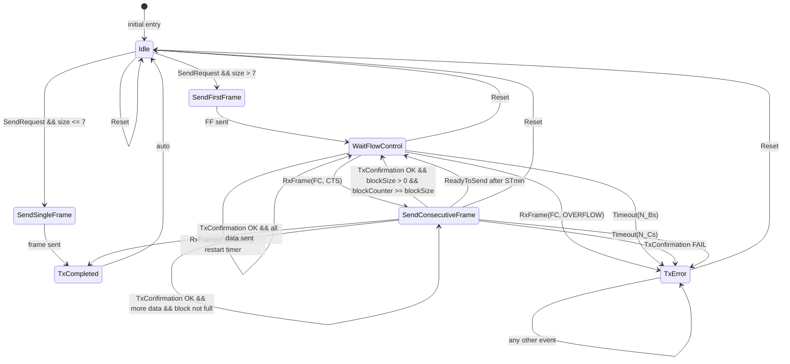
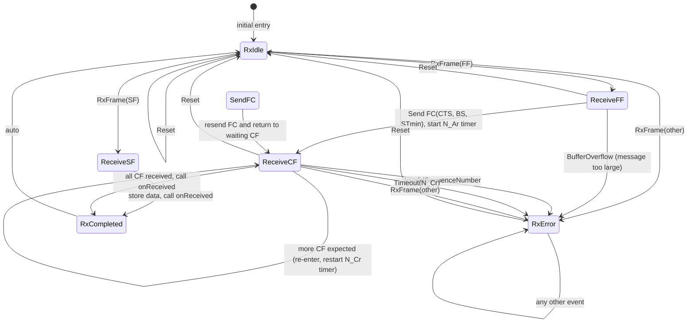

# Техзадание на реализацию протокола ISOTP

## Цель

Создать расширяемую реализацию для протокола ISOTP, чтобы была возможность использовать разные драйверы для передачи и получения CAN сообщений.

## Функциональные требования

- возможность отправлять сообщения в КАН шину
- возможность принимать сообщения из КАН шины
- поддержка приёма и передачи длинных сообщений

## Нефункциональные требования

- CAN 11 бит и 29 бит
- тип адрессации mixed
- максимальный размер полезной нагрузки 8 байт
- поддержать все N_PCI
- поддержать настраиваемые таймауты N_As, N_Ar, N_Bs, N_Br, N_Cs, N_Cr с типичными значениями по-умолчанию
- использовать конечные автоматы для реализации логики
- использовать библиотеку HFSM2 для C++17
- разделить передачу данных в шину от логики обработки потока сообщений
- использовать механизм событий вместо poll
- учесть возможность генерации исключений драйверами
- реализация должна быть для C++ 17 стандарта
- при генерации исключений драйвером переходить в аварийное состояние, из которого можно выйти через функцию reset. Информировать пользователя через колбэк onError
- поддержка битрейтов и фильтров будет задана снаружи
- для таймеров использовать интерфейс и реализовать интерфейс для Windows
- для приёма и передачи использовать разные КА
- передача максимум 4095 байт
- добавить обработку ошибок потери кадров и нарушения последовательности
- при получении полного сообщения вызывается колбэк onReceived
- протокол прнимает сконфигурированный драйвер с настроенными фильтрами
- нужно поддержать возможность параллельной отправки сообщений по разным индентификаторам CAN

## Диаграммы конечных автоматов

### Передатчик (Tx)

| Состояние | Описание |
|-----------|----------|
| `Idle` | Ожидание команды отправки |
| `SendSingleFrame` | Отправка SF (короткое сообщение ≤ 7 байт) |
| `SendFirstFrame` | Отправка FF (первый кадр длинного сообщения) |
| `WaitFlowControl` | Ожидание FC от получателя после FF или после блока CF |
| `SendConsecutiveFrame` | Отправка очередного CF с учётом BlockSize и STmin |
| `TxCompleted` | Отправка завершена успешно, автоматический переход в Idle |
| `TxError` | Аварийное состояние (таймаут, исключение драйвера, неверный FC) |



### Приёмник (Rx)

| Состояние | Описание |
|-----------|----------|
| `RxIdle` | Ожидание первого кадра (SF или FF) |
| `ReceiveSF` | Получен SF — данные сразу сохраняются, вызывается `onReceived` |
| `ReceiveFF` | Получен FF — отправляется FC(CTS, BS, STmin), запускается таймер N_Ar |
| `SendFC` | Повторная отправка Flow Control (при необходимости) |
| `ReceiveCF` | Ожидание и сборка Consecutive Frame (CF) с проверкой SN и таймаутом N_Cr |
| `RxCompleted` | Все CF получены, вызывается `onReceived`, автоматический переход в Idle |
| `RxError` | Аварийное состояние (неверный SN, таймаут, переполнение буфера) |



"## Архитектура сессий

Для поддержки параллельной отправки сообщений по разным CAN‑идентификаторам введён **менеджер сессий** `IsoTpSessionManager`. Каждое уникальное соединение (пара TxCANId / RxCANId) представляется отдельной **сессией** `IsoTpSession`.

### Компоненты

- **`IsoTpSession`** – содержит:
  - Два конечных автомата (TxFSM, RxFSM).
  - CAN‑идентификаторы (txId, rxId).
  - Локальные таймеры (таймауты N_Bs, N_Cr, N_Ar и т.д.).
  - Колбэки `onReceived` и `onError` для этой сессии.
  - Очередь исходящих сообщений (опционально).

- **`IsoTpSessionManager`** – управляет сессиями:
  - Позволяет создавать/удалять сессии по идентификатору (uint16 sessionId).
  - При получении CAN‑кадра от драйвера определяет, какой сессии он адресован (по полю `canId`), и передаёт его в `handleRxFrame()` соответствующей сессии.
  - Предоставляет метод `send(canId, data)` для отправки данных в нужную сессию (поиск сессии по `txId` или `rxId`).
  - Гарантирует потокобезопасность через `std::shared_mutex` для списка сессий.

### Диаграмма архитектуры

```
+--------------------+
|   Application      |
+--------+-----------+
         |
         v
+--------+-----------+
| IsoTpSessionManager |
+--------+-----------+
         |
    +----+----+
    |         |
    v         v
+--------+ +--------+
| Session | | Session| ...
| tx=0x7DF| | tx=0x733|
| rx=0x7E8| | rx=0x759|
+--------+ +--------+
    |         |
    +----+----+
         |
         v
+--------+-----------+
|   ICanDriver (shared)|
+--------------------+
```

### API пользователя

```cpp
// Получить экземпляр менеджера (singleton)
auto& manager = IsoTpSessionManager::instance();
manager.setDriver(&canDriver);

// Создать сессию
uint16_t sid = manager.createSession(
    0x7E0,                                     // txId (запрос)
    0x7E8,                                     // rxId (ответ)
    [](const std::vector<uint8_t>& msg) { /* onReceived */ },
    [](ErrorCode ec) { /* onError */ }
);

// Отправить данные в сессию
manager.send(0x7E0, {0x01, 0x02, 0x03});       // поиск сессии по txId

// Удалить сессию
manager.destroySession(sid);
```

### Идентификация входящих кадров

При получении CAN‑кадра от драйвера менеджер просматривает все активные сессии и передаёт кадр той, у которой `rxId == canId`. Если подходящая сессия не найдена, кадр игнорируется (или вызывается глобальный обработчик `onUnhandledFrame`).

### Потокобезопасность

- Каждая сессия использует свой `std::mutex` для защиты своих FSM и таймеров.
- Менеджер использует `std::shared_mutex` (чтение без блокировки для поиска сессии, запись для создания/удаления).

### Таймеры

Каждая сессия имеет отдельный экземпляр `ITimer`. Таймауты N_Bs, N_Cr и паузы STmin настраиваются индивидуально для сессии через `IsoTpConfig`, передаваемый при создании.

### Ограничения

- Один драйвер на все сессии (общая CAN‑шина).
- Фильтры CAN (аппаратные) должны быть настроены на все `rxId` активных сессий – это делается извне при создании/удалении сессии.
- Длительные передачи блокируют отправку только в своей сессии, не влияя на другие.

## Тестирование

- покрыть юнит тестами с mock-драйверами сценарии отправки и передачи сообщения
- протестировать отправку и приём длинного сообщения
- протестировать превышение таймаута между КАН кадрами
- протестировать ранний отсыл сообщения до получения flow control
- протестировать отпавку нового first frame до завершения прошлого сеанса
- протестировать потерю кадра
- протестировать неправильный счётчик кадров SN
- протестировать одновременную отправку в две разные сессии (параллельные транзакции)
- протестировать приём сообщений в одной сессии при активной передаче в другой
- протестировать создание и удаление сессии во время передачи данных"


