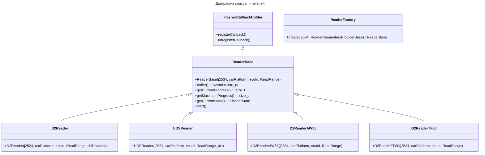

# ТЗ: Реализация чтения прошивок из ЭБУ

## 1. Цель

Чтение прошивок разных ЭБУ через единый интерфейс с поддержкой D2 и UDS протоколов.

## 2. Архитектура (текущая)

### 2.1. Диаграмма классов



### 2.2. ReaderBase

Базовый класс для всех читателей. Наследует `FlasherCallbackHolder`. Инкапсулирует поток, прогресс, состояния, буфер.

```cpp
class ReaderBase: public FlasherCallbackHolder {
public:
    ReaderBase(j2534::J2534& j2534, common::CarPlatform carPlatform,
               uint32_t ecuId, ReadRange range);
    virtual ~ReaderBase();

    FlasherState getCurrentState() const;
    size_t getCurrentProgress() const;
    size_t getMaximumProgress() const;
    const std::vector<uint8_t>& buffer() const;
    void start();

protected:
    virtual void startImpl(std::vector<std::unique_ptr<ICanChannel>>& channels) = 0;
    void setCurrentState(FlasherState state);
    void incCurrentProgress(size_t delta);
    void setMaximumProgress(size_t maxProgress);

    const common::CarPlatform _carPlatform;
    const uint32_t _ecuId;
    const ReadRange _range;
    common::J2534ChannelProvider _channelProvider;
    std::vector<uint8_t> _buffer;
};
```

### 2.3. D2Reader

Чтение по протоколу D2. Проходит последовательность шагов: wakeUp → fallAsleep → startPBL → [loadSBL → startSBL] → побайтовое чтение через checksum → wakeUp → Done. Наследует `ReaderBase` (не `D2FlasherBase`).

**Файлы:** `Flasher/flasher/D2Reader.hpp`, `Flasher/src/D2Reader.cpp` (100 строк)

### 2.4. UDSReader

Чтение по протоколу UDS (ISO 15765). Использует сервис 0x23 (`ReadMemoryByAddress`) блоками по 0x100 байт. Платформы: P3, Ford_UDS, VAG, Haval_UDS.

**Файлы:** `Flasher/flasher/UDSReader.hpp`, `Flasher/src/UDSReader.cpp` (84 строки)

### 2.5. D2ReaderAW55

Специализированный читатель для АКПП AW55-50SN. Использует `D2Messages::createReadDataByOffsetMsg()`.

**Файлы:** `Flasher/flasher/D2ReaderAW55.hpp`, `Flasher/src/D2ReaderAW55.cpp`

### 2.6. D2ReaderTF80

Специализированный читатель для АКПП TF-80SC. Использует `D2Messages::createReadTCMTF80DataByAddr()`.

**Файлы:** `Flasher/flasher/D2ReaderTF80.hpp`, `Flasher/src/D2ReaderTF80.cpp`

### 2.7. ReaderFactory

Фабрика принимает `ReaderParametersProviderBase`, диспетчеризует по `(carPlatform, ecuId, cmInfo)`:

```cpp
// Flasher/src/ReaderFactory.cpp
std::unique_ptr<ReaderBase> ReaderFactory::create(
    j2534::J2534& j2534,
    const ReaderParametersProviderBase& p)
{
    const auto platform = p.getCarPlatform();
    const auto ecuId = p.getEcuId();
    const auto& cmInfo = p.getCmInfo();
    const auto range = p.getReadRange();

    if (ecuId == 0x7A && isD2Platform(platform)) {
        auto bootloader = p.getBootloaderParams();
        if (!bootloader) throw ...;
        return std::make_unique<D2Reader>(j2534, platform, ecuId, range,
                                          std::move(bootloader->sblProvider));
    }
    if (ecuId == 0x6E && isD2Platform(platform)) {
        if (cmInfo == "aw55")  return D2ReaderAW55(...);
        if (cmInfo == "tf80_p2") return D2ReaderTF80(...);
    }
    if (isUDSPlatform(platform)) {
        auto auth = p.getAuthParams();
        if (!auth) throw ...;
        return std::make_unique<UDSReader>(j2534, platform, ecuId, range, auth->pin);
    }
    throw std::runtime_error("Unsupported platform/ECU for reading");
}
```

### 2.8. CLI — readFlash через ReaderFactory

В `VolvoFlasher.cpp` создаётся inline `CLIReaderProvider`, вызывается `ReaderFactory::create()`:

```cpp
void readFlash(...) {
    class CLIReaderProvider final : public flasher::ReaderParametersProviderBase {
        // наследует базовые ключи из конструктора
        ReadRange getReadRange() const override;
        optional<BootloaderParams> getBootloaderParams() const override;
    };
    CLIReaderProvider provider(carPlatform, ecuId, "", start, size, sbl);
    auto reader = ReaderFactory::create(j2534, provider);
    reader->start();
    // ... wait for Done
    output.write(reader->buffer());
}
```

## 3. Полный список файлов

### 3.1. Новые

| № | Файл | Описание |
|---|---|---|
| 1 | `Flasher/flasher/ParamsTypes.hpp` | `ReadRange`, `AuthorizationParams`, `BootloaderParams` |
| 2 | `Flasher/flasher/ReaderParametersProviderBase.hpp` | Provider base |
| 3 | `Flasher/flasher/FlasherCallbackHolder.hpp` | Базовый класс с callbacks |
| 4 | `Flasher/flasher/ReaderBase.hpp` | Абстрактный базовый класс читателя |
| 5 | `Flasher/src/ReaderBase.cpp` | Реализация |
| 6 | `Flasher/flasher/ReaderFactory.hpp` | Фабрика читателей |
| 7 | `Flasher/src/ReaderFactory.cpp` | Реализация фабрики |
| 8 | `Flasher/flasher/UDSReader.hpp` | UDS-читатель |
| 9 | `Flasher/src/UDSReader.cpp` | Реализация |
| 10 | `Flasher/flasher/D2ReaderAW55.hpp` | AW55 TCM |
| 11 | `Flasher/src/D2ReaderAW55.cpp` | Реализация |
| 12 | `Flasher/flasher/D2ReaderTF80.hpp` | TF80 TCM |
| 13 | `Flasher/src/D2ReaderTF80.cpp` | Реализация |

### 3.2. Изменённые

| № | Файл | Изменение |
|---|---|---|
| 14 | `Flasher/flasher/D2Reader.hpp` | Полностью переписан: наследует `ReaderBase` |
| 15 | `Flasher/src/D2Reader.cpp` | Переписан: прямой вызов D2ProtocolCommonSteps |
| 16 | `VolvoFlasher/src/VolvoFlasher.cpp` | `readFlash()` переписан под ReaderFactory |

### 3.3. Удалённые

| № | Файл | Причина |
|---|---|---|
| 17 | `Flasher/flasher/UDSMemoryReader.hpp` | Заменён на `UDSReader` |
| 18 | `Flasher/src/UDSMemoryReader.cpp` | Заменён на `UDSReader` |

## 4. Отложенные компоненты

| Компонент | Причина |
|---|---|
| `D2ReaderReadMemoryByAddr` | Чтение через 0xA6 блоками — не реализовано. `D2Reader` сейчас читает побайтово через checksum |
| `D2ChecksumReader` | Дублирует `D2Reader` — решение о необходимости не принято |

## 5. Критерии готовности

1. ✓ `ReaderBase` — общий предок для всех читателей (FlasherCallbackHolder + поток + прогресс + буфер)
2. ✓ `D2Reader` наследует `ReaderBase`, читает побайтово через checksum (D2ProtocolCommonSteps)
3. ✓ `UDSReader` читает прошивку с UDS-платформ через 0x23 блоками
4. ✓ `D2ReaderAW55` / `D2ReaderTF80` читают TCM
5. ✓ `ReaderFactory::create()` диспетчеризует по (platform, ecuId, cmInfo) через ReaderParametersProviderBase
6. ✓ `VolvoFlasher read` использует ReaderFactory (автоопределение протокола)
7. ✓ `UDSMemoryReader` удалён
8. ✓ Сборка: `cmake --build build --config Release` — 0 ошибок
