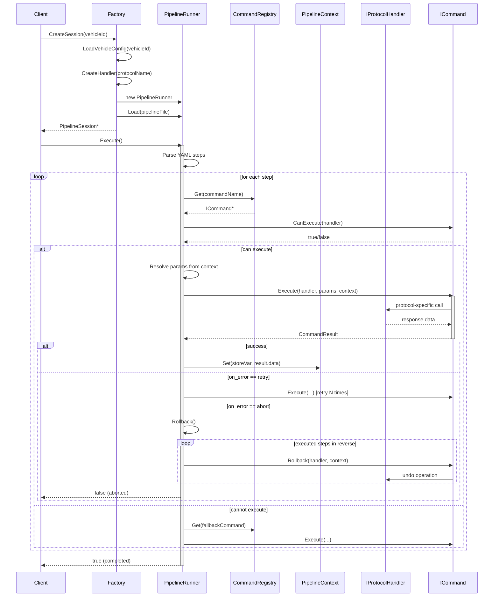
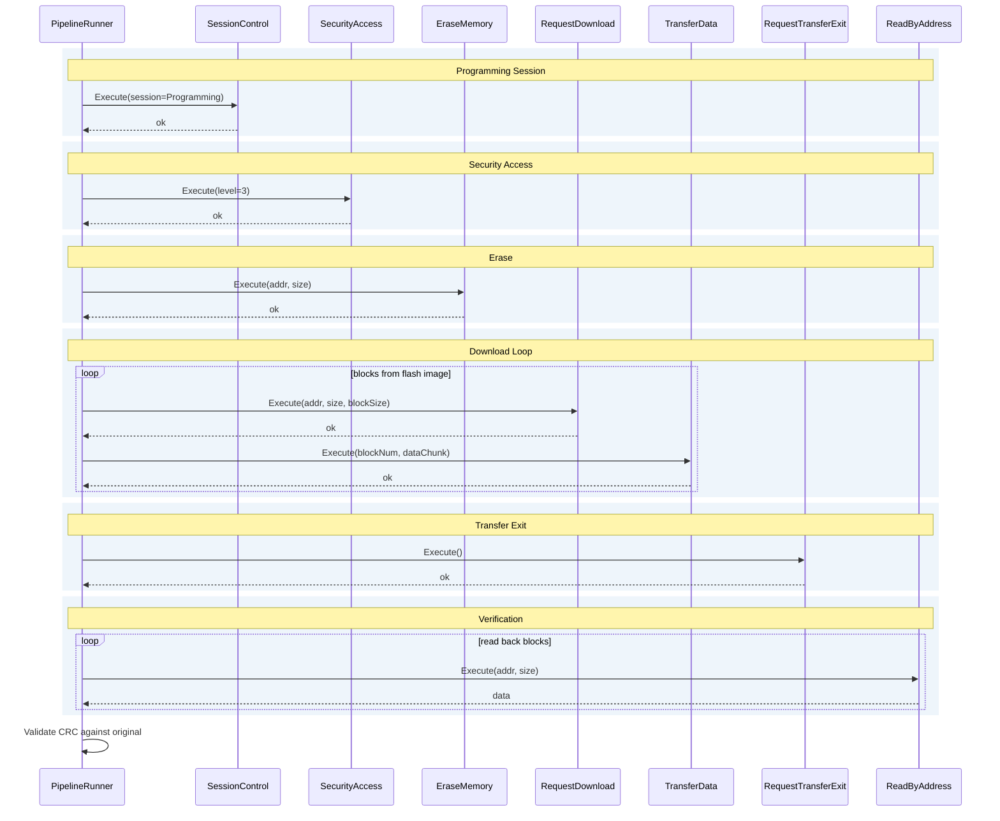

# Техническое задание  
## «Расширяемая подсистема чтения и записи ЭБУ на основе команд и пайплайнов»

### 1. Общие сведения

**1.1. Наименование системы**  
Подсистема диагностического обмена с электронными блоками управления (ЭБУ) автомобилей (далее – Система).

**1.2. Основание для разработки**  
Существующее приложение умеет прошивать ЭБУ по протоколам Volvo D2 и UDS. Необходимо добавить функцию чтения данных/прошивок, а также обеспечить поддержку новых марок (Ford UDS, Ford Focus ST 2) с минимальными затратами на модификацию ядра. Требуется архитектура, легко адаптируемая к нестандартным диагностическим процедурам и позволяющая описывать сценарии обмена через конфигурационные файлы.

**1.3. Цели разработки**  
- Реализовать чтение памяти ЭБУ (идентификаторы, калибровки, полные образы) с поддержкой DID и адресного доступа.
- Переиспользовать и унифицировать имеющийся код прошивки.
- Обеспечить добавление новых автомобилей без перекомпиляции ядра, в идеале — только за счёт конфигурационных файлов.
- Построить систему как набор независимых «кирпичиков»-команд, из которых в конфигурациях собираются пайплайны выполнения.
- Гарантировать возможность отката выполненных операций при возникновении ошибок в цепочках команд.

### 2. Функциональные требования

**2.1. Чтение данных из ЭБУ**  
- Чтение логических блоков: идентификационные данные, калибровки, полный дамп памяти.
- Методы чтения:
  - Read Data By Identifier (DID);
  - Read Memory By Address (адресное чтение с автоматическим разбиением на чанки).
- Для каждого блока задаётся основной метод и опциональный резервный (fallback). При неудаче основного система автоматически переключается на резервный.
- Валидация прочитанных данных: контроль размера, CRC.

**2.2. Запись (прошивка) ЭБУ**  
- Полноценная запись образов через сервисы программирования, поддерживаемые протоколом:
  - смена диагностических сессий,
  - SecurityAccess,
  - стирание памяти (EraseMemory или эквивалент),
  - RequestDownload / TransferData / RequestTransferExit (для UDS),
  - верификация записанного путём обратного чтения через подсистему чтения.
- Для нестандартных протоколов (Focus ST 2) допускается произвольный набор операций, описываемый пайплайном.

**2.3. Поддержка протоколов**  
- Volvo D2 (имеющаяся реализация);
- UDS (ISO 14229) – базовая реализация, расширяемая под конкретные марки;
- Ford Focus ST 2 – специфичный протокол, требующий отдельного обработчика.
- Добавление нового протокола не должно затрагивать ядро системы.

**2.4. Работа с пайплайнами команд**  
- Любая операция (чтение блока, полная прошивка, диагностическая процедура) может быть описана в виде последовательности шагов – команд.
- Конфигурация пайплайнов выполняется в YAML/JSON-файлах.
- Поддерживаются управляющие конструкции: условия (`If`), циклы (`Loop`), вызов вложенных пайплайнов (`CallPipeline`).
- Шаги используют переменные контекста, арифметические и логические выражения.
- Пайплайны могут загружаться и исполняться как интерпретатором, так и компилироваться в оптимизированный код (опционально).

### 3. Архитектурные требования

Система строится на основе трёхслойной архитектуры, дополненной уровнем команд и интерпретатором пайплайнов.

#### 3.1. Слой 1: Транспортный
Абстрагирует физический уровень (CAN, K-Line, Ethernet). Предоставляет единый интерфейс для отправки и приёма сообщений. Скрывает детали работы с оборудованием от верхних слоёв.

#### 3.2. Слой 2: Обработчики протоколов (`IProtocolHandler`)
Инкапсулируют реализацию конкретного диагностического протокола. Каждый обработчик предоставляет атомарные методы, соответствующие элементарным операциям протокола.  
Обязательные методы интерфейса:
```cpp
class IProtocolHandler {
public:
    virtual bool Connect() = 0;
    virtual void Disconnect() = 0;
    virtual void SessionControl(uint8_t session) = 0;
    virtual std::vector<uint8_t> SecurityAccess(uint8_t level, const std::vector<uint8_t>& seed) = 0;
    virtual std::vector<uint8_t> ReadDataByIdentifier(uint16_t did) = 0;
    virtual std::vector<uint8_t> ReadMemoryByAddress(uint32_t address, size_t size) = 0;
    virtual void RequestDownload(uint32_t addr, size_t size, size_t blockSize) = 0;
    virtual void TransferData(uint8_t blockNum, const std::vector<uint8_t>& data) = 0;
    virtual void RequestTransferExit() = 0;
    virtual void EraseMemory(uint32_t addr, size_t size) = 0;
    virtual std::vector<uint8_t> RoutineControl(uint16_t id, const std::vector<uint8_t>& params) = 0;
    virtual bool SupportsCapability(Capability cap) = 0;
};
```
Реализации: `UdsProtocolHandler`, `VolvoD2ProtocolHandler`, `FocusSt2ProtocolHandler`.

#### 3.3. Слой 3: Адаптеры данных и прошивки
Конфигурационные объекты, описывающие **какие** данные читать/писать. Не содержат протокольной логики, только декларативные параметры.
- **Дескриптор чтения (`ReadDescriptor`)** – карта блоков: имя блока, метод (DID/Address), адрес/DID, размер, размер чанка, fallback-метод, ожидаемая CRC.
- **Дескриптор прошивки (`FlashDescriptor`)** – структура памяти, уровень доступа, параметры стирания, максимальный размер блока передачи, алгоритм CRC, флаг верификации после записи.
Адаптеры могут храниться как C++ классы или как внешние JSON/YAML-файлы, подгружаемые при старте.

#### 3.4. Уровень команд и пайплайнов (надстройка)

**3.4.1. Интерфейс команды `ICommand`**  
Каждая атомарная операция («кирпичик») оформляется как объект, реализующий интерфейс `ICommand`. Это обеспечивает единообразие выполнения, отката, проверки совместимости и логирования.

```cpp
class ICommand {
public:
    virtual ~ICommand() = default;

    // Уникальное имя команды – идентификатор в реестре и конфигах
    virtual std::string GetName() const = 0;

    // Проверка возможности выполнения с данным обработчиком протокола
    virtual bool CanExecute(IProtocolHandler* handler) const = 0;

    // Выполнение команды
    virtual std::unique_ptr<CommandResult> Execute(
        IProtocolHandler* handler,
        const Json::Value& params,
        PipelineContext& context) = 0;

    // Откат результатов команды (если применимо)
    virtual bool Rollback(IProtocolHandler* handler,
                          PipelineContext& context) {
        return false; // по умолчанию не поддерживается
    }

    // Оценка длительности выполнения (мс), используется для индикации прогресса
    virtual uint32_t EstimateDuration(const Json::Value& params) const {
        return 0;
    }
};

struct CommandResult {
    bool success;
    std::vector<uint8_t> data;
    std::string errorMessage;
};
```

**3.4.2. Реестр команд (Command Registry)**  
Глобальный реестр, хранящий экземпляры `ICommand` по их именам. Обеспечивает поиск команды во время интерпретации пайплайна.  
- `Register(std::unique_ptr<ICommand> cmd)` – добавление команды.
- `Get(const std::string& name) -> ICommand*` – получение по имени.
Реестр пополняется при инициализации системы, а также может расширяться плагинами протоколов.

**3.4.3. Пайплайн (Pipeline)**  
Конфигурационный файл (YAML/JSON), описывающий последовательность шагов-команд. Каждый шаг содержит:
- `command` – имя зарегистрированной команды,
- `params` – параметры (адреса, DID, значения), могут включать ссылки на переменные контекста `{{variable}}`,
- `store` – имя переменной для сохранения результата,
- `on_error` – поведение при ошибке: `abort`, `retry N`, `fallback` (с указанием fallback-команды), `continue`.
Поддерживаются вложенные структуры: `Loop` (цикл по диапазону или списку), `If` (условие), `CallPipeline` (вызов другого файла).

**3.4.4. Интерпретатор пайплайнов (PipelineRunner)**  
Сервис, загружающий конфигурацию пайплайна и выполняющий шаги:
- Загружает YAML, проверяет корректность ссылок.
- Создаёт контекст (`PipelineContext`) для хранения переменных.
- Последовательно выполняет шаги, используя реестр команд.
- При вызове `Rollback` (если пайплайн прерван) проходит выполненные шаги в обратном порядке и вызывает `Rollback()` у команд, поддерживающих эту операцию.
- Ведёт детальное журналирование каждого шага.

**3.4.5. Взаимодействие с трёхслойной основой**  
- Примитивные команды (`ReadDID`, `SecurityAccess`, `TransferData` и т.д.) в методе `Execute` вызывают соответствующие методы `IProtocolHandler`. Это позволяет переиспользовать код обработчиков без дублирования.
- Стандартные оркестраторы (например, полный цикл прошивки UDS) могут быть реализованы как пайплайны, загружаемые из файлов, или как жёстко закодированные классы для максимальной производительности. Рекомендуется предоставить готовые пайплайны для типовых операций, чтобы инженеры могли использовать их как образец.

**3.4.6. Фабрика**  
Компонент, который по идентификатору автомобиля (VIN, CAN ID ЭБУ) определяет:
- какой `IProtocolHandler` необходимо создать,
- какой пайплайн (или готовый оркестратор) использовать для чтения/записи,
- какие адаптеры (дескрипторы) загрузить и передать в контекст пайплайна.
Фабрика работает с базой сопоставлений, хранящейся в конфигурационном файле или базе данных.

#### 3.5. Диаграммы взаимодействия классов

**3.5.1. Диаграмма классов (статическая структура)**

```mermaid
classDiagram
    class IProtocolHandler {
        <<interface>>
        +Connect() bool
        +Disconnect() void
        +SessionControl(uint8_t session) void
        +SecurityAccess(uint8_t level, vector~uint8_t~ seed) vector~uint8_t~
        +ReadDataByIdentifier(uint16_t did) vector~uint8_t~
        +ReadMemoryByAddress(uint32_t address, size_t size) vector~uint8_t~
        +RequestDownload(uint32_t addr, size_t size, size_t blockSize) void
        +TransferData(uint8_t blockNum, vector~uint8_t~ data) void
        +RequestTransferExit() void
        +EraseMemory(uint32_t addr, size_t size) void
        +RoutineControl(uint16_t id, vector~uint8_t~ params) vector~uint8_t~
        +SupportsCapability(Capability cap) bool
    }

    class ICommand {
        <<interface>>
        +GetName() string
        +CanExecute(IProtocolHandler* handler) bool
        +Execute(IProtocolHandler* handler, Json::Value params, PipelineContext& context) unique_ptr~CommandResult~
        +Rollback(IProtocolHandler* handler, PipelineContext& context) bool
        +EstimateDuration(Json::Value params) uint32_t
    }

    class CommandResult {
        +bool success
        +vector~uint8_t~ data
        +string errorMessage
    }

    class CommandRegistry {
        -unordered_map~string, unique_ptr~ICommand~~ commands
        +Register(unique_ptr~ICommand~ cmd) void
        +Get(string name) ICommand*
    }

    class PipelineContext {
        -map~string, Value~ variables
        +Get(string name) Value
        +Set(string name, Value value) void
        +Eval(string expr) Value
    }

    class PipelineRunner {
        -CommandRegistry* registry
        -PipelineContext context
        +Load(string yamlPath) bool
        +Execute() bool
        +Rollback() void
    }

    class VehicleConfig {
        +string protocolHandlerName
        +string readPipelineFile
        +string flashPipelineFile
        +string readDescriptorFile
        +string flashDescriptorFile
    }

    class ReadDescriptor {
        +string name
        +ReadMethod method
        +uint16_t did
        +uint32_t address
        +uint32_t size
        +uint32_t chunkSize
        +ReadMethod fallbackMethod
        +uint32_t expectedCrc
    }

    class FlashDescriptor {
        +MemoryRegion[] memoryLayout
        +uint8_t accessLevel
        +EraseParameters eraseParams
        +uint32_t maxBlockSize
        +CrcType crcAlgorithm
        +bool verifyAfterWrite
    }

    class Factory {
        +CreateSession(VehicleId vehicleId) PipelineSession*
        -LoadVehicleConfig(VehicleId vehicleId) VehicleConfig
        -CreateHandler(string name) IProtocolHandler*
    }

    IProtocolHandler <|.. UdsProtocolHandler : implements
    IProtocolHandler <|.. VolvoD2ProtocolHandler : implements
    IProtocolHandler <|.. FocusSt2ProtocolHandler : implements

    ICommand <|.. SessionControl : implements
    ICommand <|.. SecurityAccess : implements
    ICommand <|.. ReadDID : implements
    ICommand <|.. ReadByAddress : implements
    ICommand <|.. RequestDownload : implements
    ICommand <|.. TransferData : implements
    ICommand <|.. RequestTransferExit : implements
    ICommand <|.. EraseMemory : implements
    ICommand <|.. RoutineControl : implements
    ICommand <|.. If : implements
    ICommand <|.. Loop : implements
    ICommand <|.. CallPipeline : implements
    ICommand <|.. Delay : implements
    ICommand <|.. ValidateCrc : implements
    ICommand <|.. Log : implements

    PipelineRunner --> CommandRegistry : uses
    PipelineRunner --> PipelineContext : owns
    PipelineRunner --> IProtocolHandler : calls
    PipelineRunner --> ICommand : executes
    CommandRegistry --> ICommand : contains
    ICommand --> IProtocolHandler : calls in Execute
    ICommand --> PipelineContext : reads/writes in Execute
    ICommand ..> CommandResult : returns
    Factory ..> VehicleConfig : reads
    Factory --> IProtocolHandler : creates
    Factory --> PipelineRunner : configures
    ReadDescriptor --> PipelineContext : loaded as variables
    FlashDescriptor --> PipelineContext : loaded as variables
```



**3.5.2. Диаграмма последовательности (выполнение пайплайна)**



**3.5.3. Диаграмма последовательности (процесс прошивки UDS)**



### 4. Детальные требования к компонентам

**4.1. Интерфейс `IProtocolHandler`**  
Полностью описан в п.3.2. Дополнительно:
- `ReadMemoryByAddress` должен поддерживать чтение больших областей путём внутреннего разбиения на чанки (размер определяется возможностями транспорта, например 4 КБ). Альтернативно разбиение может быть реализовано на уровне команды-обёртки `ReadByAddress`.
- `SupportsCapability` возвращает true для затребованной возможности (`CAP_READ_BY_ADDRESS`, `CAP_DOWNLOAD`, `CAP_ERASE_MEMORY` и т.д.). Это позволяет командам в `CanExecute` проверять совместимость.

**4.2. Конкретные команды**  
Каждая команда – это класс, наследующий `ICommand`. Примеры и их зоны ответственности:

- **SessionControl** – устанавливает диагностическую сессию.  
  `CanExecute`: всегда true.  
  `Execute`: вызывает `handler->SessionControl(session)`.  
  `Rollback`: пытается вернуть сессию в Default.

- **SecurityAccess** – разблокирует ЭБУ под заданным уровнем.  
  `Execute`: получает seed, вычисляет key (или получает из внешнего модуля), отправляет key.  
  `Rollback`: перезапускает сессию, сбрасывая доступ (опционально).

- **ReadDID** – читает данные по идентификатору.  
  `Execute`: `handler->ReadDataByIdentifier(did)`.  
  `EstimateDuration`: ~100 мс.

- **ReadByAddress** – адресное чтение.  
  `Execute`: может использовать внутренний цикл для разбиения на чанки, вызывает `ReadMemoryByAddress` обработчика.  
  `CanExecute`: проверяет `CAP_READ_BY_ADDRESS`.

- **RequestDownload**, **TransferData**, **RequestTransferExit** – атомарные шаги прошивки.  
  `TransferData` при откате может не поддерживать `Rollback` (частично записанные данные обычно не откатываются, но можно пометить сессию как аварийную).  

- **EraseMemory** – стирание сектора.  
  `CanExecute`: проверяет `CAP_ERASE_MEMORY`.

- **Composite-команды** (макросы):  
  - `If` – принимает условие и два набора шагов (then/else).  
  - `Loop` – циклически выполняет тело с подстановкой переменной.  
  - `CallPipeline` – загружает и выполняет внешний файл пайплайна как подпрограмму.  
  Эти команды реализуются через интерпретатор и могут не быть «кирпичиками» в смысле вызова обработчика протокола, но они также наследуют `ICommand` для единообразия исполнения.

- **Утилиты**: `Delay`, `ValidateCrc`, `Log`, `CheckResponse` – вспомогательные команды, не требующие обработчика протокола.

**4.3. Реестр команд**  
- Хранит `std::unordered_map<std::string, std::unique_ptr<ICommand>>`.
- Потокобезопасность не требуется, если регистрация происходит только на старте.
- Предоставляет метод `Get(name)`, возвращающий указатель (может быть nullptr).

**4.4. Пайплайн и интерпретатор**  
Формат YAML:
```yaml
pipeline: ReadCalibration
description: "Чтение калибровок с fallback"
variables:
  start_addr: 0x0A0000
  size: 0x040000
  chunk: 0x1000
steps:
  - command: SessionControl
    params: { session: Extended }
  - command: SecurityAccess
    params: { level: 3 }
  - command: Loop
    params:
      var: offset
      from: 0
      to: "{{size}}"
      step: "{{chunk}}"
      body:
        - command: ReadByAddress
          params:
            address: "{{start_addr + offset}}"
            size: "{{chunk}}"
          store: temp
        - command: Log
          params:
            message: "Read block at {{start_addr + offset}}"
  - command: ValidateCrc
    params:
      algorithm: CRC32
      expected: "0xDEADBEEF"
```
Интерпретатор:
- Разбирает YAML в объектную модель.
- Создаёт контекст с начальными переменными.
- Для каждого шага:
  1. Находит команду в реестре.
  2. Проверяет `CanExecute` (если false – вызывает fallback, если задан).
  3. Выполняет `Execute`, передавая разобранные параметры и контекст.
  4. Обрабатывает результат: сохраняет переменную, проверяет успешность.
  5. Если `on_error` = `retry N`, при неудаче повторяет шаг до N раз.
  6. Если ошибка и политика `abort`, запускает процедуру отката (Rollback) для всех выполненных шагов в обратном порядке и завершает пайплайн.
- Для вложенных команд `Loop`, `If`, `CallPipeline` интерпретатор рекурсивно обрабатывает их тела.

**4.5. Адаптеры и фабрика**  
- Адаптеры (дескрипторы) хранятся в JSON/YAML и могут быть загружены как переменные контекста перед запуском пайплайна.
- Фабрика:
  ```cpp
  struct VehicleConfig {
      std::string protocolHandlerName;   // "UDS", "VolvoD2", "FocusST2"
      std::string readPipelineFile;      // путь к пайплайну чтения
      std::string flashPipelineFile;     // путь к пайплайну записи
      std::string readDescriptorFile;    // путь к дескриптору чтения
      std::string flashDescriptorFile;   // путь к дескриптору прошивки
  };
  ```
- Фабрика по VehicleId (VIN) выбирает из базы нужную конфигурацию, создаёт `IProtocolHandler`, загружает адаптеры, подготавливает контекст и возвращает готовый к запуску объект `PipelineSession`.

### 5. Требования к расширяемости

- Добавление нового автомобиля, использующего уже поддерживаемый протокол (например, UDS): создаются конфигурационные файлы дескрипторов и, при необходимости, пайплайна. Перекомпиляция не требуется.
- Поддержка нового протокола: разрабатывается новый класс `IProtocolHandler` и набор примитивных команд к нему, реализующих `ICommand`. Команды регистрируются в реестре. После этого протокол доступен для любых пайплайнов.
- Динамическая загрузка обработчиков протоколов (через DLL/SO) с авторегистрацией команд – опциональное требование на будущее.

### 6. Обработка ошибок и журналирование

- Примитивные команды при обнаружении ошибки протокола (отрицательный ответ NRC, тайм-аут) возвращают `CommandResult` с `success = false` и описанием ошибки.
- Интерпретатор ведёт журнал: метка времени, имя команды, входные параметры, результат (успех/ошибка), длительность выполнения.
- При включённом режиме отката, если пайплайн прерывается, интерпретатор вызывает `Rollback()` для всех выполненных команд и пишет в журнал соответствующую запись.
- Для отладки предусмотрен «пошаговый режим» с возможностью установки точек останова на шагах пайплайна.

### 7. Требования к тестированию

- Модульное тестирование каждой команды с мок-обработчиком (`MockProtocolHandler`), проверка корректности вызовов методов обработчика.
- Интеграционное тестирование интерпретатора на различных пайплайнах (условия, циклы, fallback).
- Проверка механизма отката: искусственная вставка ошибки в середине цепочки и контроль того, что Rollback вызван для всех предыдущих команд.
- Тестирование стандартных пайплайнов (UDS чтение/запись) на симуляторе ЭБУ.
- Регрессионное тестирование существующей функциональности прошивки после рефакторинга.

### 8. Этапы реализации

1. **Рефакторинг текущего кода**  
   Выделение протокольной логики в `UdsProtocolHandler` и `VolvoD2ProtocolHandler`, реализующих `IProtocolHandler`. Убедиться, что старый код прошивки работает через эти интерфейсы.

2. **Создание базового набора команд**  
   Реализация `ICommand`, примитивных команд (SessionControl, SecurityAccess, ReadDID, ReadByAddress, RequestDownload, TransferData, RequestTransferExit, EraseMemory) и их регистрация в реестре.

3. **Разработка интерпретатора пайплайнов**  
   Загрузка YAML, выполнение шагов, обработка `on_error`, поддержка `If`, `Loop`, `CallPipeline`. Реализация механизма отката.

4. **Интеграция адаптеров и фабрики**  
   Загрузка дескрипторов из файлов, создание фабрики, сопоставляющей автомобили с обработчиками и пайплайнами.

5. **Перенос типовых операций в пайплайны**  
   Написание YAML-пайплайнов для чтения блоков (с DID и адресным доступом, fallback) и полной прошивки UDS. Тестирование на симуляторе и реальном оборудовании.

6. **Добавление Ford UDS**  
   Подготовка конфигурационных файлов для нескольких моделей Ford, проверка на стандартном UDS-пайплайне.

7. **Реализация поддержки Focus ST 2**  
   Разработка `FocusSt2ProtocolHandler`, его команд, специфичных пайплайнов чтения и записи.

8. **Документирование и создание примеров**  
   Руководство по добавлению новой марки: описание формата дескрипторов, пайплайнов, список стандартных команд.

### 9. Требования к документации

- **Для разработчиков**: архитектура системы, API `ICommand` и `IProtocolHandler`, реестр команд, интерпретатор пайплайнов, механизм отката.
- **Для инженеров-диагностов**: синтаксис YAML-пайплайнов, описание всех доступных команд (примитивных и составных), инструкция по созданию пайплайна для нового автомобиля на базе существующего протокола.
- **Примеры**: готовые файлы пайплайнов и дескрипторов для Volvo (D2), Ford (UDS), Ford Focus ST 2.

### 10. Критерии приёмки

- Существующая функциональность прошивки Volvo D2 и UDS полностью работоспособна после рефакторинга (прохождение регрессионных тестов).
- Чтение данных (DID, адресное) выполняется как через жёсткие оркестраторы, так и через загружаемые пайплайны.
- Добавление новой модели Ford UDS осуществляется созданием конфигурационных файлов без перекомпиляции.
- Для Focus ST 2 работают чтение и запись через собственный обработчик и пайплайны.
- Интерпретатор пайплайнов корректно обрабатывает условия, циклы, fallback и выполняет откат при ошибке.
- Все автоматические тесты (модульные и интеграционные) проходят успешно.
- Документация позволяет стороннему специалисту добавить поддержку нового автомобиля с использованием существующих протоколов в течение одного рабочего дня.
